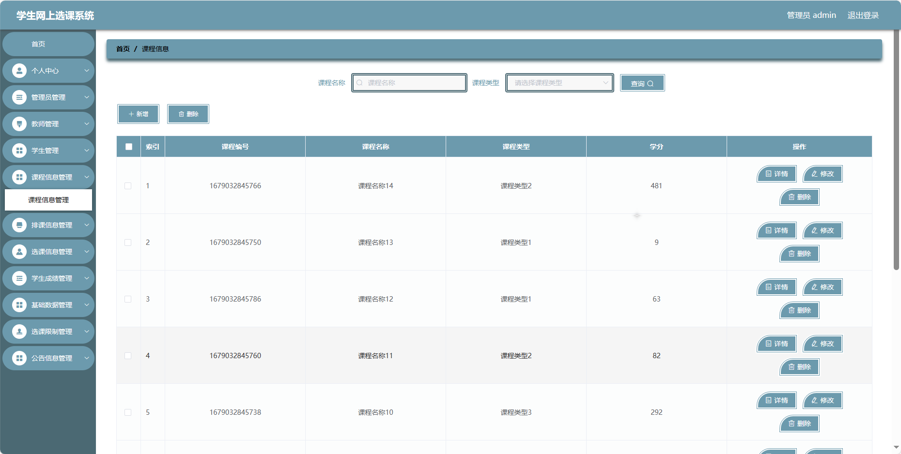

基于Springboot的学生网上选课系统（程序+论文）
=
### 完整代码获取地址：从戎源码网 ([https://armycodes.com/](https://armycodes.com/))
### 作者微信：19941326836  QQ：952045282 
### 承接计算机毕业设计、Java毕业设计、Python毕业设计、深度学习、机器学习
### 选题+开题报告+任务书+程序定制+安装调试+论文+答辩ppt 一条龙服务
### 所有选题地址https://github.com/nature924/allProject

一、项目介绍
---
基于Spring Boot框架实现的学生网上选课系统，系统包含三种角色：管理员、用户,教师，系统主要功能如下。

### 【管理员后台功能】
- 首页：系统管理员后台的主页，。
- 个人中心：管理员个人信息管理，包括修改密码和查看个人信息。
- 管理员管理：添加、编辑、删除管理员账号。
- 教师管理：添加、编辑、删除教师账号。
- 学生管理：添加、编辑、删除学生账号。
- 课程信息管理：添加、编辑、删除课程信息。
- 排课信息管理：排课计划的管理，包括课程时间、地点等信息。
- 选课信息管理：学生选课信息的查看和管理。
- 学生成绩管理：录入和管理学生成绩。
- 基础数据管理：管理系统的基础数据，包括班级、成绩类型、第几节、课程类型、公告类型、周次、学期等。
- 选课限制管理：设置选课的限制条件。
- 公告信息管理：发布、编辑、删除系统公告。

### 【教师后台功能】
- 首页：教师后台的主页。
- 个人中心：教师个人信息管理。
- 学生管理：查看和管理教学班学生信息。
- 课程信息管理：查看和管理所教授的课程信息。
- 排课信息管理：查看和管理排课计划。
- 选课信息管理：查看和管理学生选课信息。
- 学生成绩管理：录入和管理学生成绩。
- 选课限制管理：查看和管理选课的限制条件。
- 公告信息管理：发布、编辑、删除公告信息。

### 【学生后台功能】
- 首页：学生后台的主页。
- 个人中心：修改密码和查看个人信息。
- 课程信息管理：查看可选课程和已选课程信息。
- 排课信息管理：查看课程的排课信息。
- 选课信息管理：选课和查看已选课程信息。
- 学生成绩管理：查看个人成绩。
- 选课限制管理：查看选课的限制条件。
- 公告信息管理：查看系统公告。

二、项目技术
---
- 编程语言：Java
- 数据库：MySQL
- 项目管理工具：Maven
- 前端技术：VUE、HTML、Jquery、Bootstrap
- 后端技术：Spring、SpringMVC、MyBatis

三、运行环境
---
- 操作系统：Windows、macOS都可以
- JDK版本：JDK1.8以上都可以
- 开发工具：IDEA、Ecplise、Myecplise都可以
- 数据库: MySQL5.7以上都可以
- Tomcat：任意版本都可以
- Maven：任意版本都可以

四、运行截图
---
### 论文截图：

### 程序截图：

